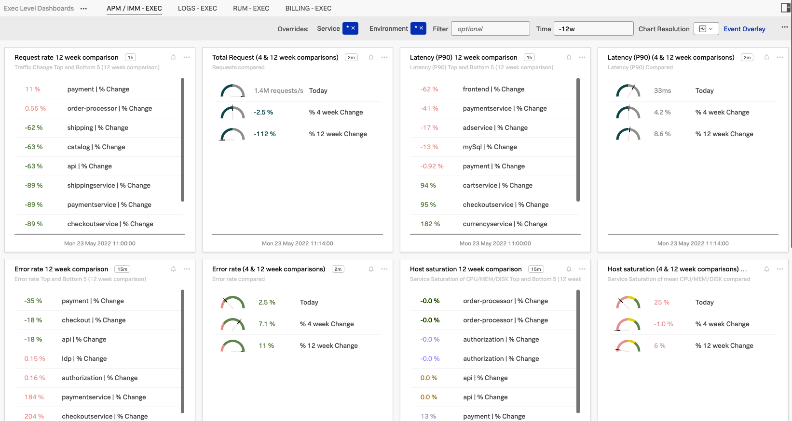
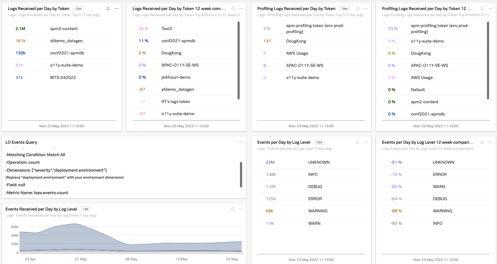
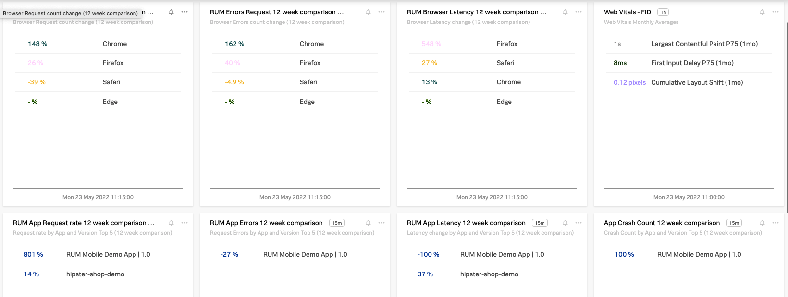
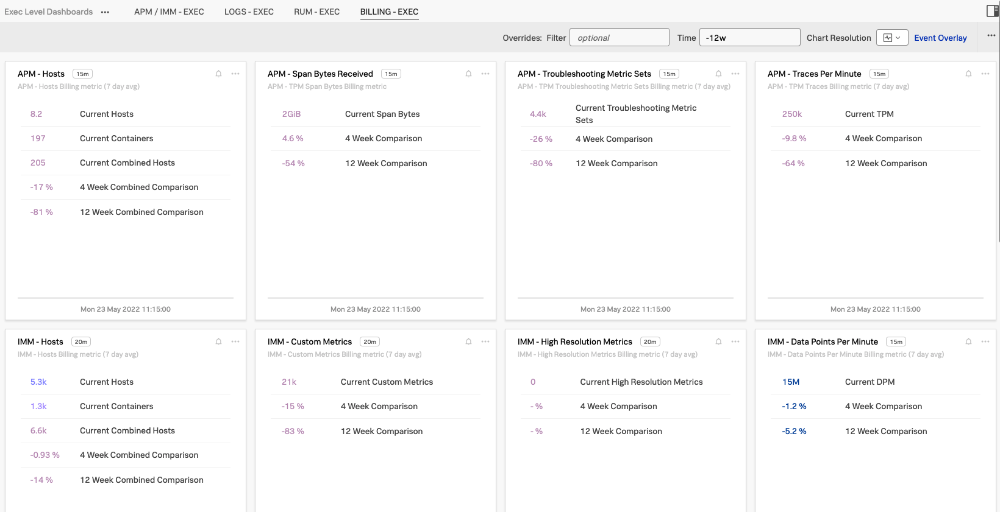

# Executive Dashboards
Executive Dashboards in this group are focused on high level comparisons over time (4 week and 12 week)
- Wherever possible Org level metrics are used for compatibility
- Included Terraform files expect a Splunk Observability token to be available in the `signalfx_auth_token` environment variable.
  - Env Var Example: `export TF_VAR_signalfx_auth_token=this-is-my-splunk-observability-token`
- Log Events dashboards can be enriched with a Log Observer Metric noted below

**Reminder:** These dashboards can be edited to include more context or split by dimensions specific to your own concerns. 


## Log Observer Severity Metric
This metric enables visualizing log observer ingest by severity/log level.
```
Matching Condition: Match All

Operation: count

Dimensions: ["severity","deployment.environment"]
(Replace "deployment.environment" with your environment dimension)

Field: null

Metric Name: logs.events.count

```

## Screenshots
APM / IMM (RED Metrics) overview:


Logs overview:


Real User Monitoring (RUM) overview:


Billing overview:
