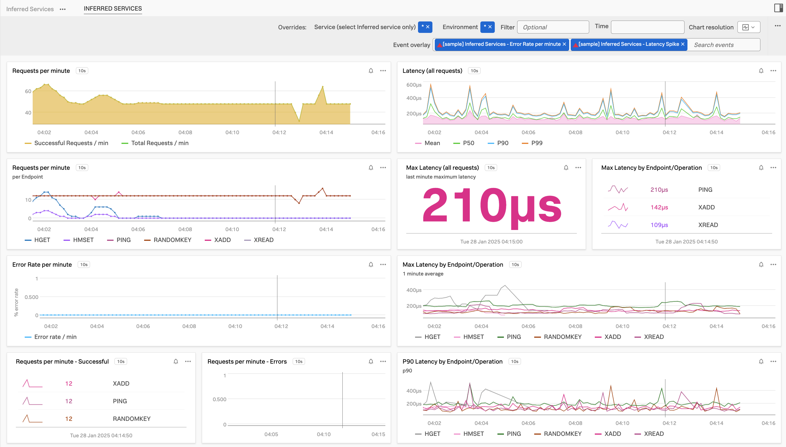

# Inferred Services - assets to help observing

1. [Dashboard Group - Inferred Services](./Dashboard_Group_Inferred%20Services.json)

Feel free to also use

2. [Sample Detectors: Latency Spike (>3s for 90% of 5min); Error Rate (>50%, sudden change)](../../detectors/inferred-services-detectors/README.md)

Learn more about Inferred Services: 
- [What are Inferred Services](https://docs.splunk.com/observability/en/apm/apm-spans-traces/inferred-services.html)
- [Metrics available for Inferred Services](https://docs.splunk.com/observability/en/apm/span-tags/metricsets.html#available-default-mms-metrics-and-dimensions)

## Inferred Services - Dashboard Group

1. Import Dashboard Group
*From UI:*
Click on '+' on the top right and select Import->Dashboard Group.

2. Find your dashboard group `Inferred Services` and use as a starting point to create charts.

Screenshot:
