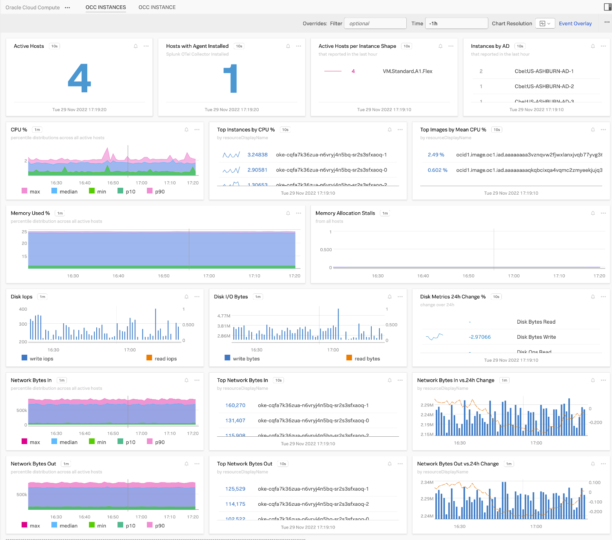
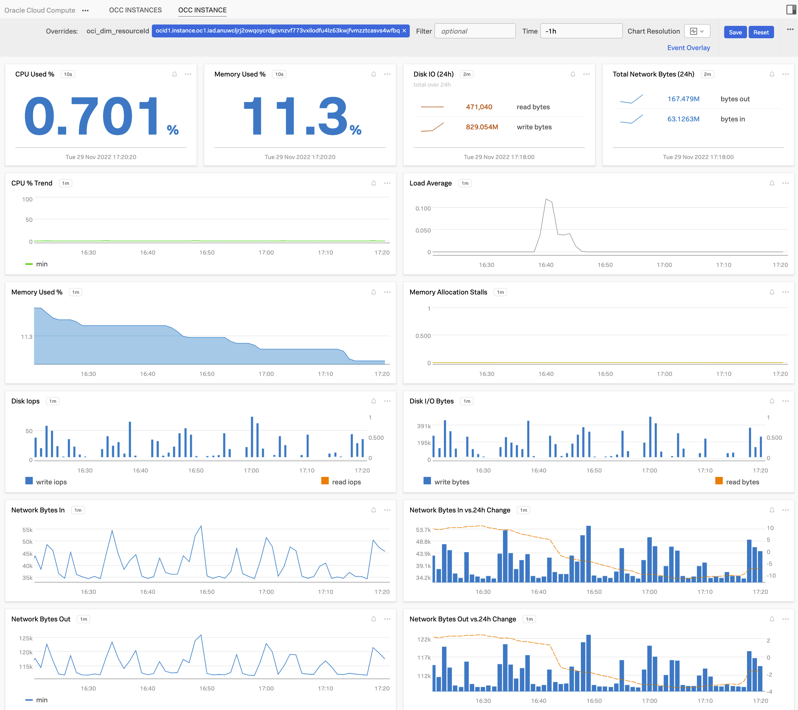

# Oracle Cloud Infrastructure (OCI) Example Content

NOTE: The example content included here presumes you have connected to Oracle
Cloud using the metrics forwarding integration available [here](https://github.com/splunk/oracle-cloud-examples-splunk-observability/tree/master/samples/oci-monitoring-metrics-to-splunk-observability-python).
You may also want to collect log events using the integration available [here](https://github.com/splunk/oracle-cloud-examples-splunk-observability/tree/master/samples/oci-logs-splunk-hec)

You should be able to import these examples directly using the UI. The option is
available using the "+"(upper right corner) -> Import -> Dashboard Group option.

The content will provide:

1. Aggregate View:

2. Instance View:

