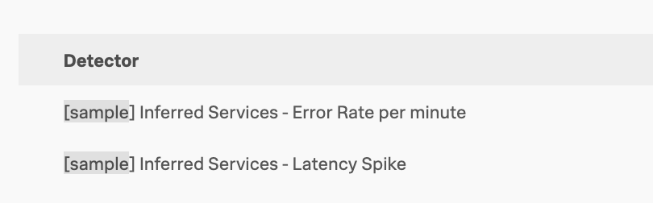
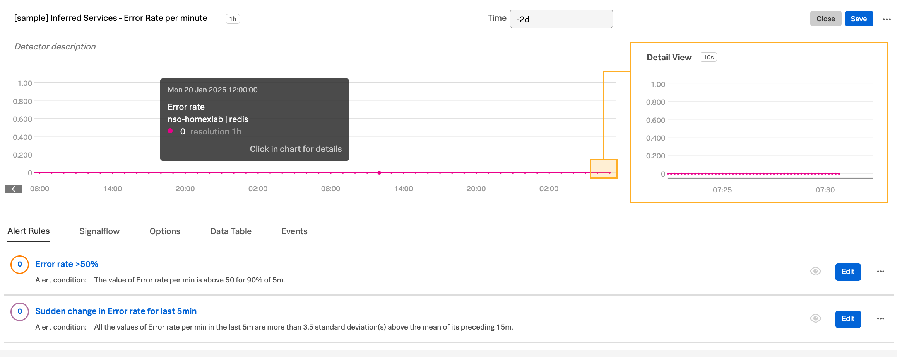
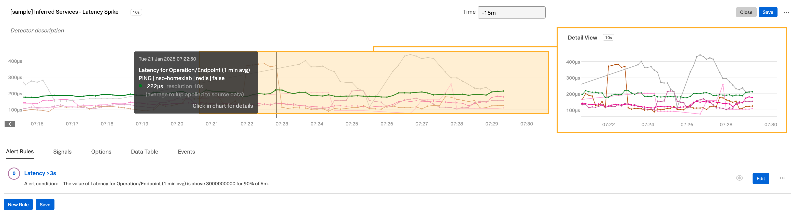

# Inferred Services - assets to help observing

1. [Detector: Latency Spike (>3s for 90% of 5min)](./POST_Detector_latency_spike.sh)

2. [Detector: Error Rate (>50%, sudden change)](./POST_Detector_error_rate.sh)

Feel free to also use

3. [Dashboard Group - Inferred Services](../../dashboards-and-dashboard-groups/inferred-services-dg/README.md)

Learn more about Inferred Services: 
- [What are Inferred Services](https://docs.splunk.com/observability/en/apm/apm-spans-traces/inferred-services.html)
- [Metrics available for Inferred Services](https://docs.splunk.com/observability/en/apm/span-tags/metricsets.html#available-default-mms-metrics-and-dimensions)

## Inferred Services - Sample Detectors

Use curl command to post the detector (replace `Token` and `Realm` as required).

These can be used as a starting point to customise signals, thresholds, messaging etc.

Screeshots:

