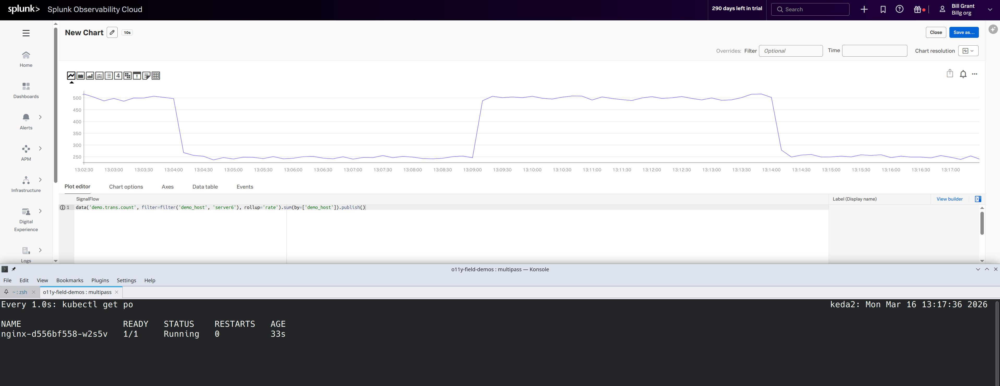
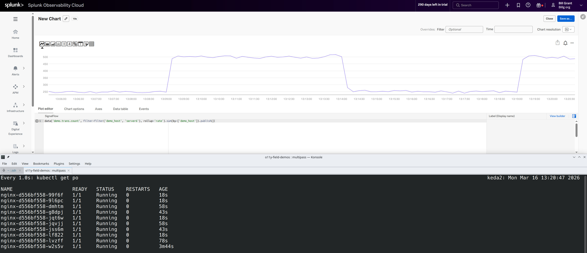
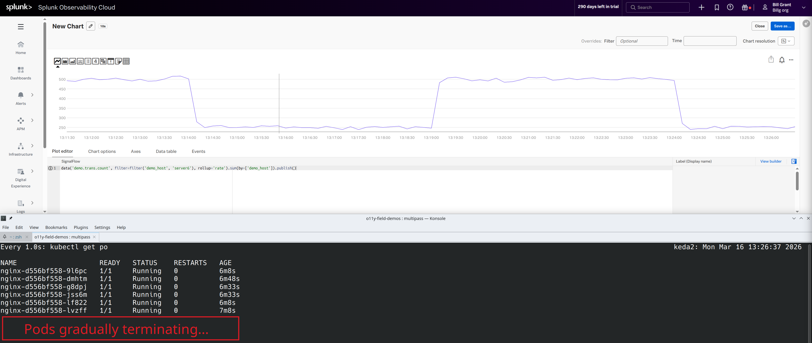

# Keda

## Overview

This will show an example of configuring keda to scale up and down based on metrics. The example uses a very simple demo metric but can be tailored to use metrics that are more meaningful (like request rates, middleware lag, etc.).

## Prerequisites

In this example we will use [docker](https://docs.docker.com/engine), [k3d](https://k3d.io/), [kubectl](https://kubernetes.io/docs/tasks/tools/install-kubectl-linux/), and [helm](https://helm.sh/docs/intro/install/).

### docker

On a linux instance, install [docker engine](https://docs.docker.com/engine/install/ubuntu/).

```bash
sudo apt remove $(dpkg --get-selections docker.io docker-compose docker-compose-v2 docker-doc podman-docker containerd runc | cut -f1)
```

```bash
# Add Docker's official GPG key:
sudo apt update
sudo apt install ca-certificates curl
sudo install -m 0755 -d /etc/apt/keyrings
sudo curl -fsSL https://download.docker.com/linux/ubuntu/gpg -o /etc/apt/keyrings/docker.asc
sudo chmod a+r /etc/apt/keyrings/docker.asc

# Add the repository to Apt sources:
sudo tee /etc/apt/sources.list.d/docker.sources <<EOF
Types: deb
URIs: https://download.docker.com/linux/ubuntu
Suites: $(. /etc/os-release && echo "${UBUNTU_CODENAME:-$VERSION_CODENAME}")
Components: stable
Signed-By: /etc/apt/keyrings/docker.asc
EOF

sudo apt update
```

```bash
sudo apt install docker-ce docker-ce-cli containerd.io docker-buildx-plugin docker-compose-plugin
```

```bash
sudo groupadd docker
sudo usermod -aG docker $USER
```

Exit the shell and go back in.

Run `docker images` to confirm setup was successful.
```bash
$ docker images
IMAGE   ID             DISK USAGE   CONTENT SIZE   EXTRA
```

### k3d

Then install k3d:

```bash
wget -q -O - https://raw.githubusercontent.com/k3d-io/k3d/main/install.sh | bash
k3d cluster create mycluster
```

### kubectl

Then install kubectl:

```bash
curl -LO "https://dl.k8s.io/release/$(curl -L -s https://dl.k8s.io/release/stable.txt)/bin/linux/amd64/kubectl"
```

```bash
sudo install -o root -g root -m 0755 kubectl /usr/local/bin/kubectl
rm kubectl
```

And now we can check kubernetes is working:

```bash
$ kubectl get po -A
NAMESPACE     NAME                                      READY   STATUS      RESTARTS   AGE
kube-system   coredns-ccb96694c-dglpd                   1/1     Running     0          38s
kube-system   helm-install-traefik-bkxwc                0/1     Completed   1          39s
kube-system   helm-install-traefik-crd-rjgpj            0/1     Completed   0          39s
kube-system   local-path-provisioner-5cf85fd84d-x5hs7   1/1     Running     0          38s
kube-system   metrics-server-5985cbc9d7-ndb9n           1/1     Running     0          38s
kube-system   svclb-traefik-92e82ee9-rpgq7              2/2     Running     0          27s
kube-system   traefik-5d45fc8cc9-x2fjq                  1/1     Running     0          27s
```

### helm

```bash
curl -fsSL -o get_helm.sh https://raw.githubusercontent.com/helm/helm/main/scripts/get-helm-4
chmod 700 get_helm.sh
./get_helm.sh
```

```bash
rm get_helm.sh
```

And we can check helm is working:

```bash
$ helm list -A
NAME            NAMESPACE       REVISION        UPDATED                                 STATUS  CHART                           APP VERSION
traefik         kube-system     1               2026-03-16 17:02:20.055253182 +0000 UTC deployedtraefik-27.0.201+up27.0.2       v2.11.10   
traefik-crd     kube-system     1               2026-03-16 17:02:18.621175995 +0000 UTC deployedtraefik-crd-27.0.201+up27.0.2   v2.11.10
```

## Install keda

First install [keda](https://keda.sh/)

```bash
helm repo add kedacore https://kedacore.github.io/charts  
helm repo update

helm install keda kedacore/keda --namespace keda --create-namespace
```

Then download the [latest crds from the repo](https://github.com/kedacore/keda/releases) and install them.

```bash
wget https://github.com/kedacore/keda/releases/download/v2.19.0/keda-2.19.0-crds.yaml
kubectl apply --server-side -f keda-2.19.0-crds.yaml
```

## Setup the nginx example with Splunk Observability Cloud

Based on the [example here](https://keda.sh/docs/2.19/scalers/splunk-observability/) (with minor adjustments):

- Either clone the repo or copy the yaml files from this directory.
- Change `2_auth.yaml` and add the base64 encoded token and realm
  - An example is provided for the `us1` realm, encoded
- Then apply them

```bash
kubectl apply -f 1_nginx.yaml
kubectl apply -f 2_auth.yaml
kubectl apply -f 3_scaler.yaml
```

## View in O11y Cloud and in the terminal

In the terminal, run:

```bash
watch -n 1 kubectl get po
```

In O11y Cloud, create a new chart with the following Signalflow

```
data('demo.trans.count', filter=filter('demo_host', 'server6'), rollup='rate').sum(by=['demo_host']).publish()
```

The result will be that during the spikes `nginx` will scale up, and during the valleys `nginx` will scale down.

At the start:


When it is scaling up:


And when it is scaling down:
