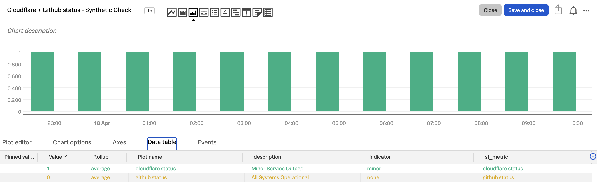

# Third-party Status Page API Check to Metric
This example API test shows how to call multiple APIs, collect data, turn that data into a usable JSON payload, and send it off to another API.  
This test creates metrics using a Splunk Synthetics API test. 
The test and it's configuration are included in this directory:
- [`synthetics_thirdparty_status_api_check.tf`](./synthetics_thirdparty_status_api_check.tf) 
    - Uses the [Splunk Synthetics Terraform provider](https://registry.terraform.io/providers/splunk/synthetics/latest/docs)

For a detailed description of this test and how it functions check out the [Splunk Lantern Article: Constructing an API test JSON payload](https://lantern.splunk.com/Observability/Product_Tips/Synthetic_Monitoring/Constructing_an_API_test_JSON_payload_for_alerting_on_external_dependencies)

## Synthetic API Test
The synthetic API test will call the CloudFlare and GitHub status pages and report a metric with a value of 1 (status is impacted) or 0 (status is normal) for each:
- `cloudflare.status`
- `github.status`

These metrics include dimensions for description of any impact to status and an indicator (none, minor, major, or critical).

### Required Splunk Synthetic Global Variables
The following global variables are **REQUIRED** to run the included API test.
- `org_ingest_token`: A provisioned INGEST token

