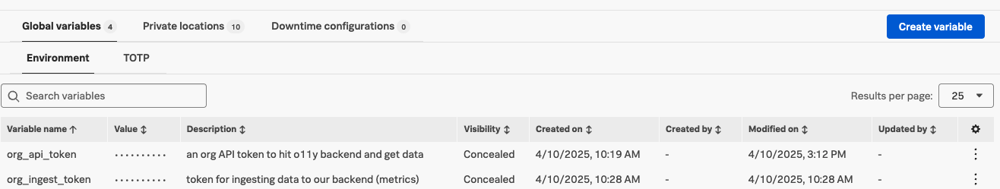

# Token Expiration Detector using Splunk Synthetics
This detector relies on metrics created by a Splunk Synthetics API test. That test and it's configuration are also included in this directory along with the detector as Terraform `.tf` files.
- [`synthetics_token_expiration_api_check.tf`](./synthetics_token_expiration_api_check.tf) 
    - Uses the [Splunk Synthetics Terraform provider](https://registry.terraform.io/providers/splunk/synthetics/latest/docs)
- [`detector_token_expiration.tf`](detector_token_expiration.tf) 
    - Uses the [Signalfx Terraform Provider](https://registry.terraform.io/providers/splunk-terraform/signalfx/latest/docs)

## Synthetic API Test
The synthetic API test will call the [`/organization` endpoint](https://dev.splunk.com/observability/reference/api/organizations/latest#endpoint-retrieve-organization) for your Splunk Observability organization and collect the list of tokens expiring in the next 7 and 30 days. Those token names will be added as dimension attributes to two new metrics named:
- `tokens.expiring.7days`
- `tokens.expiring.30days`

These metrics and dimensions will be sent to your organization's ingest endpoint and will power your detector.

### Required Splunk Synthetic Global Variables
The following global variables are **REQUIRED** to run the included API test.
- `org_api_token`: A provisioned API token (Read-only is fine)
- `org_ingest_token`: A provisioned INGEST token

## Token Expiration Metrics and Detection
Both `tokens.expiring.7days` and `tokens.expiring.30days` can be charted as you normally would with any other metric.

The [included alert](./detector_token_expiration.tf) includes custom thresholds for both of the included metrics. If you'd prefer these can easily be split into two alerts of different severities. Simply alert when either of the signals is greater than 0.