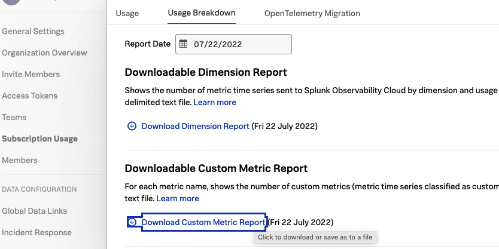

# Usage Reporting Scripts

## Custom Metric Reports
This script prases unstructured Custom Metric Reports and outputs easy to read table of the values from highest to lowest.

Special thanks to Robert Castley!

### Using The Custom Metric Report Script
**Pre-Requisite:** Download your Custom Metric Report from Splunk Observability like so:


1. Pull down this script
2. Install any required packages with `pip install -r requirements.txt`
3. Run the script on your downloaded Custom Metrics Report. 
    - E.G. `python custom-metric-report-parser.py -r ~/Downloads/2022-07-22_mts-by-metric.txt `


#### Full CLI Options
```
# python custom-metric-report-parser.py -h                           

usage: custom-metric-report-parser.py [-h] [-c CATEGORY] [-l LIMIT] -r REPORT

Splunk Observability Cloud - Custom Metrics Report Parser

optional arguments:
  -h, --help            show this help message and exit
  -c CATEGORY, --category CATEGORY
                        1 (Host), 2 (Container), 3 (Custom), 4 (Hi-Res), 5 (Bundled)
  -l LIMIT, --limit LIMIT
                        Limit no. of metrics displayed in table
  -r REPORT, --report REPORT
                        Custom Metric Report
```